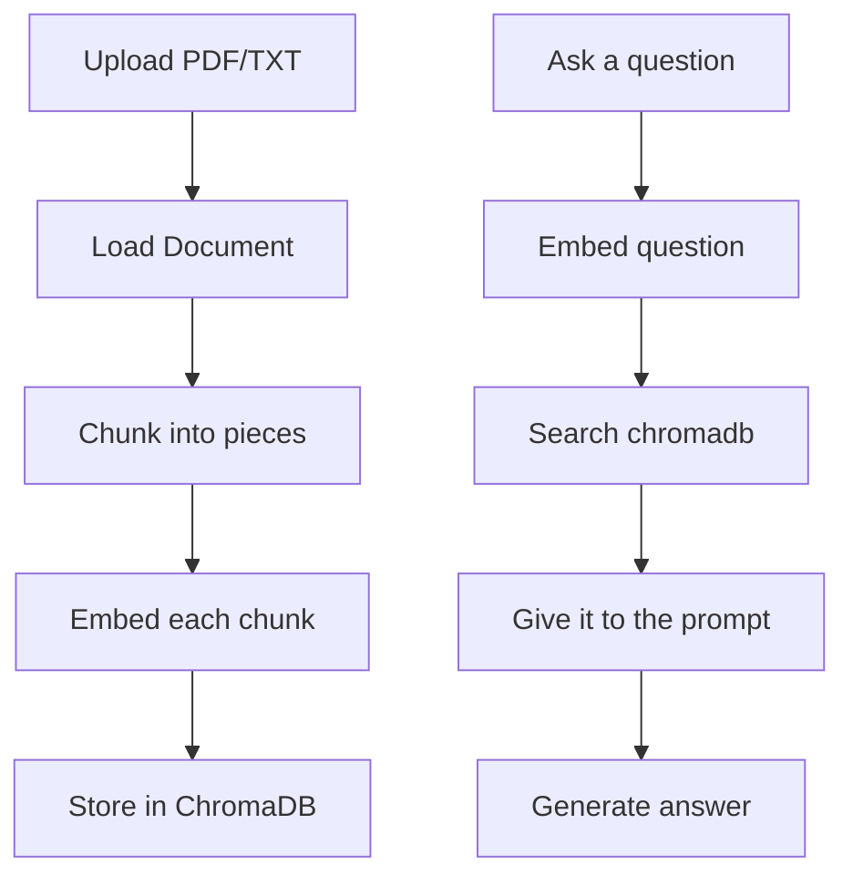

# RAG Application

I built a simple Q&A chatbot to get familiar with the LangChain framework.

It lets you upload a document (pdf or txt) and then ask questions about it.
LangChain handles the orchestration (loading, chunking, prompting), ChromaDB does the searching, and Gemini actually answers. LangChain connects all the pieces.

## Setup

### 1. Create a virtual environment
```bash
python -m venv venv
source venv/bin/activate        # Mac
```

### 2. Install dependencies
```bash
pip install -r requirements.txt
```

### 3. Add your Google API key
Edit `.env`:
```
GEMINI_API_KEY="your-key-here"
```

### 4. Run the app
```bash
streamlit run app.py
```

## How It Works



